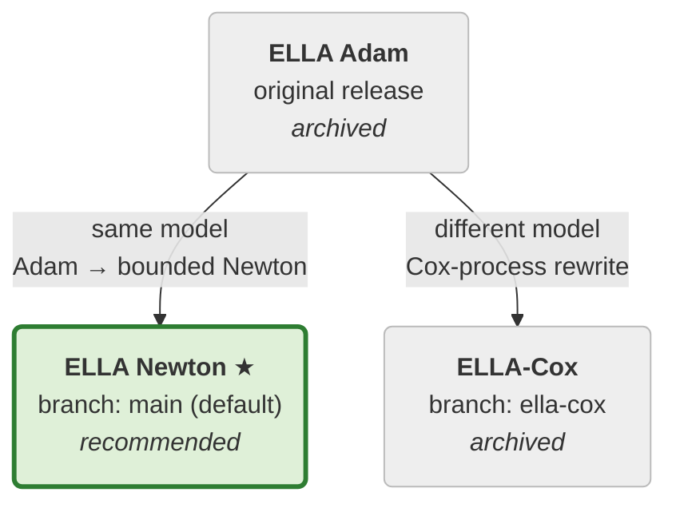

# ELLA

## Quick Installation

Requires Python ≥ 3.9. All dependencies are declared in `pyproject.toml` and
installed automatically.

Install directly from GitHub:
```
pip install "git+https://github.com/jadexq/ELLA.git"
```

Or from a local clone (use `-e` for an editable/development install):
```
git clone https://github.com/jadexq/ELLA.git
cd ELLA
pip install .        # or: pip install -e .
```

Then:
```python
from ELLA import ELLA
```

## Quick Start
Check out the `mini_demo.ipynb` for a quick start.

Check out the [tutorial pages](https://jadexq.github.io/ELLA/) for demos and documentations.

## Repo Structure
```
./ELLA/
├── pyproject.toml % project config & dependencies
├── ELLA % ELLA source code
│   ├── __init__.py
│   └── ELLA.py
├── docs % source code of the tutorial website
│   └── ...
├── tutorials % code and data for the minimum and complete demos
│   ├── mini_demo
│   └── complete_demo
├── archive % legacy code from the original ELLA release
│   ├── issues
│   └── scripts
│       ├── analysis % mRNA characteristic analysis code
│       └── preprocessing % data preprocessing code
└── README.md
```

## Repo History

ELLA exists in three variants, all descending from the original release. They live
on different branches:



- **ELLA Newton** (`main`, current and recommended): The most up-to-date version of ELLA. Same NHPP model as ELLA
  Adam, but the alternative fit uses a bounded-Newton solver: deterministic,
  reproducible, faster. Also uses ray-cast registration and polygon-only inputs.
- **ELLA Adam** (or ELLA v1, archived): The original release. Same NHPP model, alternative fit
  by Adam. See the archived **ELLA v1** tutorial.
- **ELLA-Cox** (`ella-cox`, archived): A Cox-process rewrite of the intensity (a
  different model, not just a different optimizer).

## Processed Data (Archived)
Seq-Scope
- the input that ELLA takes: [seqscope_data_dict.pkl](https://github.com/jadexq/ELLA/releases/download/v0.0.1/seqscope_data_dict.pkl)
- the registered expression data: [seqscope_df_registered_saved.pkl](https://github.com/jadexq/ELLA/releases/download/v0.0.1/seqscope_df_registered_saved.pkl)
  

Stereo-seq
- the input that ELLA takes: [stereoseq_data_dict.pkl](https://github.com/jadexq/ELLA/releases/download/v0.0.1/stereoseq_data_dict.pkl)
- the registered expression data: [stereoseq_df_registered_saved.pkl](https://github.com/jadexq/ELLA/releases/download/v0.0.1/stereoseq_df_registered_saved.pkl)
  

SeqFISH+
- the input that ELLA takes: [seqfish_data_dict.pkl](https://github.com/jadexq/ELLA/releases/download/v0.0.1/seqfish_data_dict.pkl)
- the registered expression data: [seqfish_df_registered_saved.pkl](https://github.com/jadexq/ELLA/releases/download/v0.0.1/seqfish_df_registered_saved.pkl)

Merfish mouse brain
- the input that ELLA takes: [merfish_mouse_brain_data_dict.pkl](https://github.com/jadexq/ELLA/releases/download/v0.0.1/merfish_mouse_brain_data_dict.pkl)
- the registered expression data: [merfish_mouse_brain_df_registered_saved.pkl](https://github.com/jadexq/ELLA/releases/download/v0.0.1/merfish_mouse_brain_df_registered_saved.pkl)

